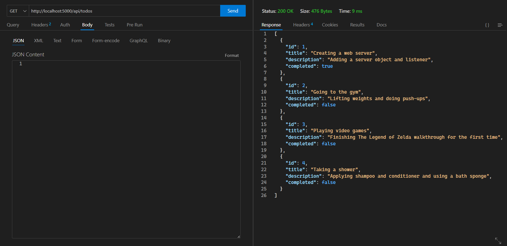
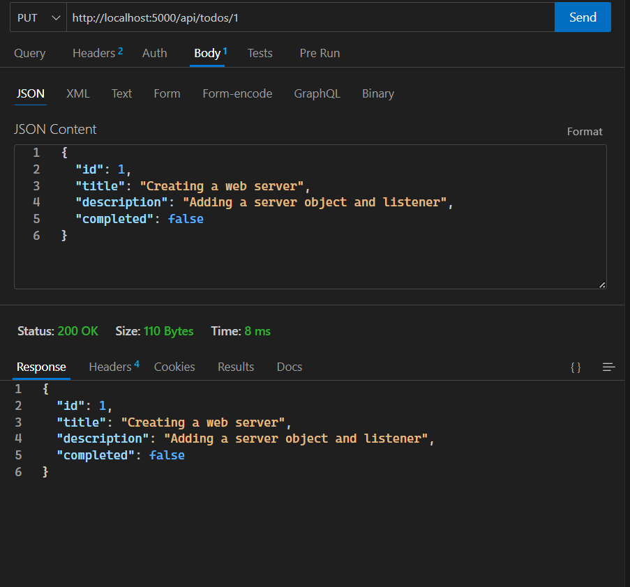
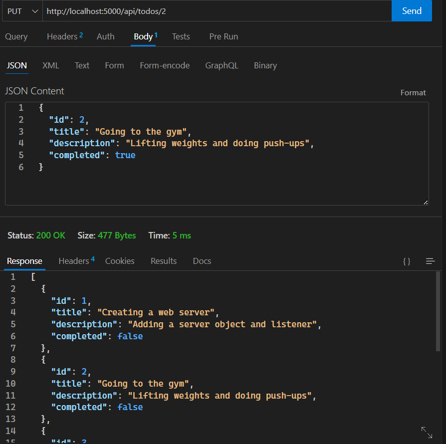
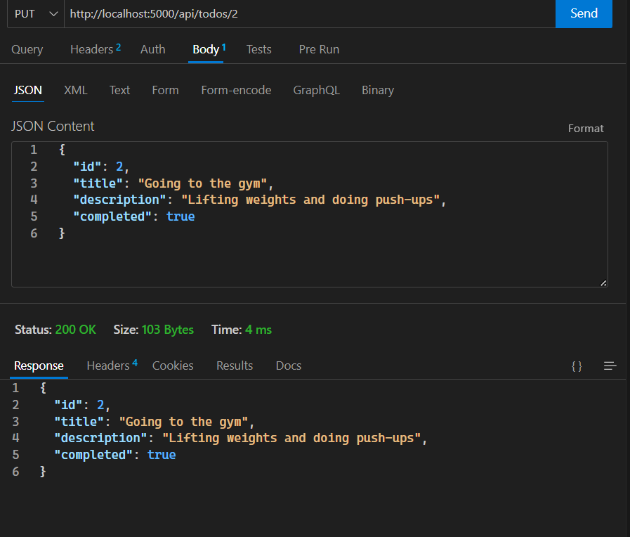
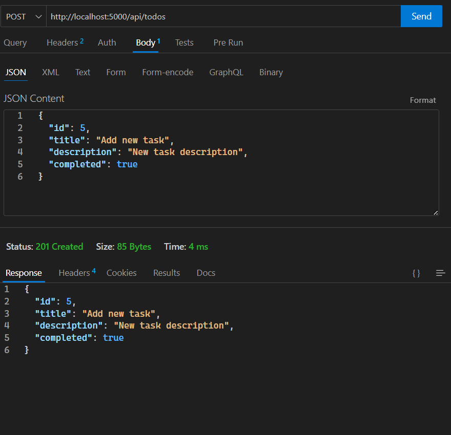
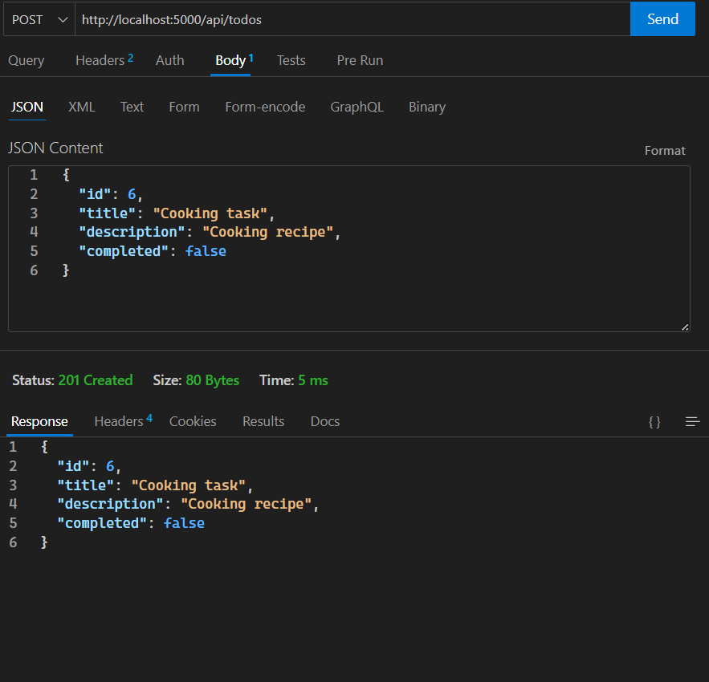
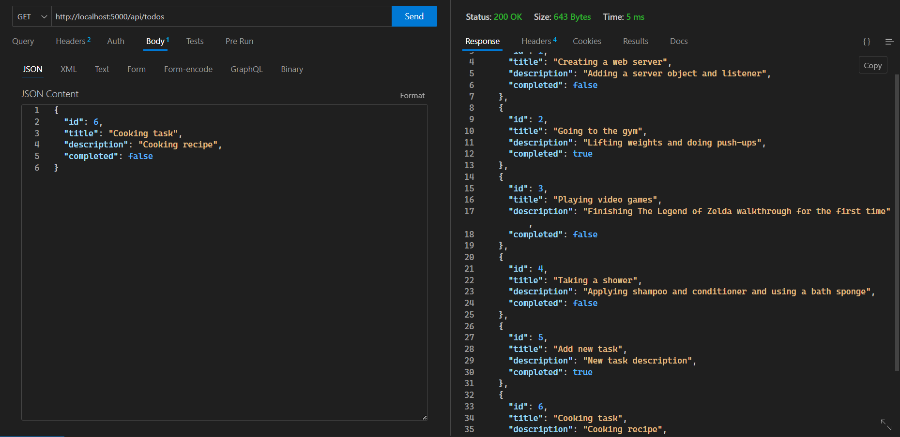

# Activity 1

- Make a `GET` request to get all data

- Modify "completed" attribute of 2 tasks :

`PUT` request before :

`PUT` request after :

- Create 2 new tasks :

A. See results above.

B. The tasks created and modified appear when we make a `GET` request to the server.

