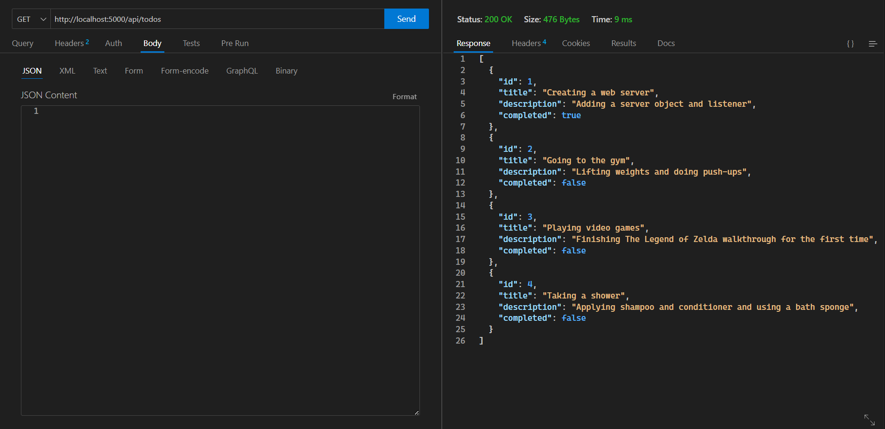
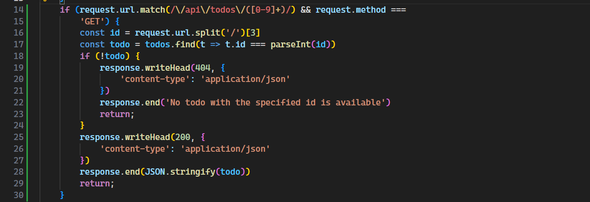
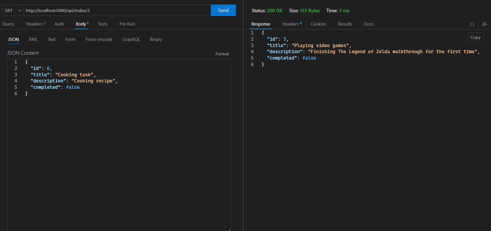
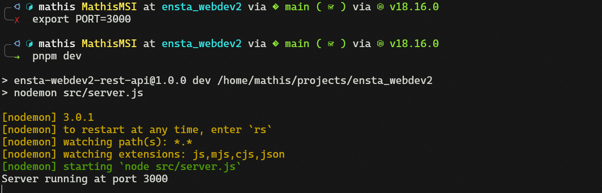
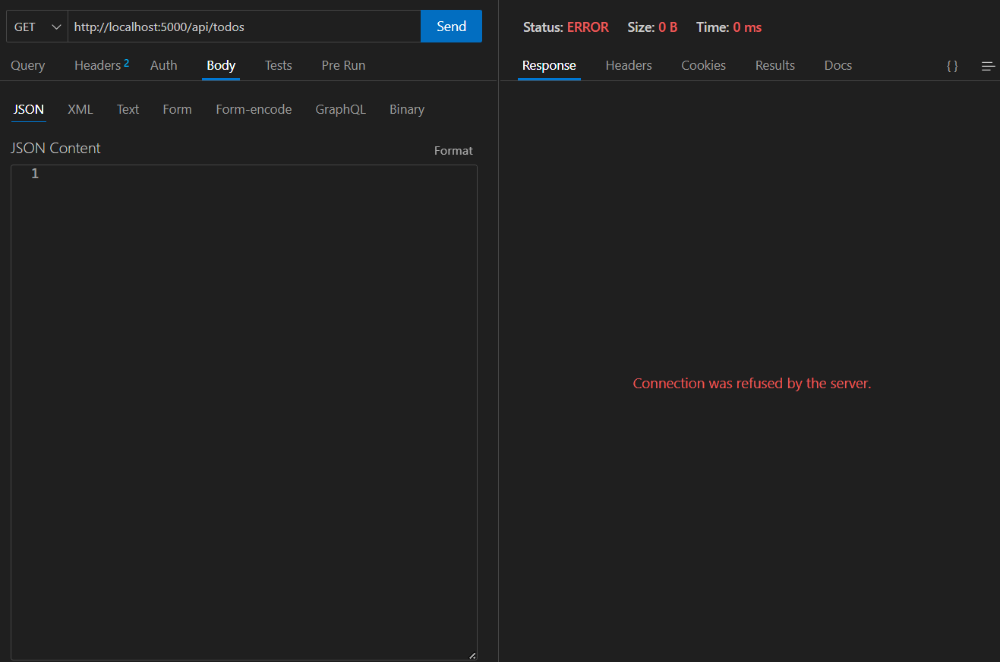
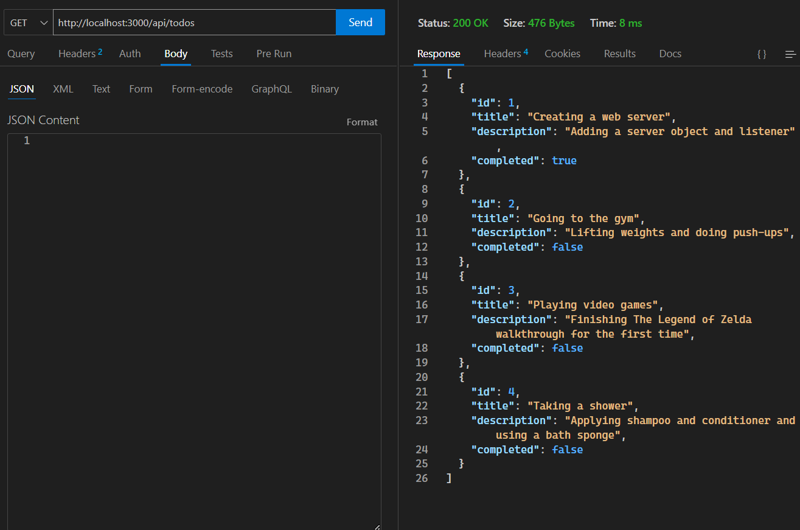

# Activity 1

- Make a `GET` request to get all data

- Modify "completed" attribute of 2 tasks :

`PUT` request before :

`PUT` request after :

- Create 2 new tasks :

A. See results above.

B. The tasks created and modified appear when we make a `GET` request to the server.

# Activity 2

The JS part for implementing the `GET` endpoint for one todo is :

The request to get one todo is :

# Activity 3

Change PORT in the terminal and rerun the server :

Verify that the server is not running on PORT 5000 anymore :

Verify that the server is running on new PORT 3000 :

