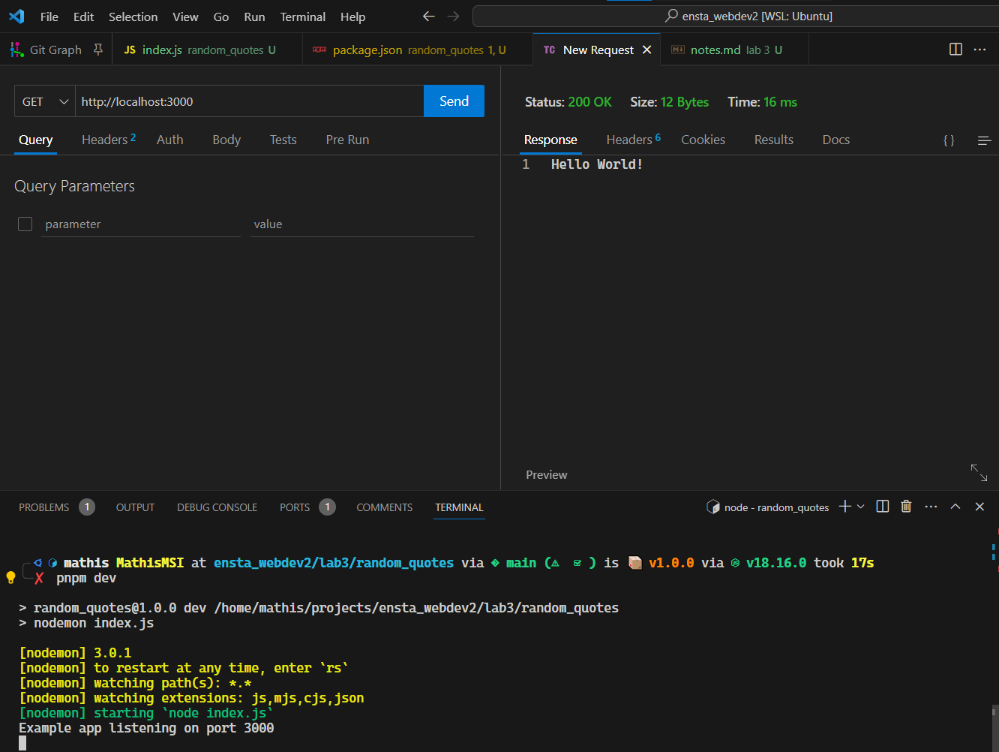
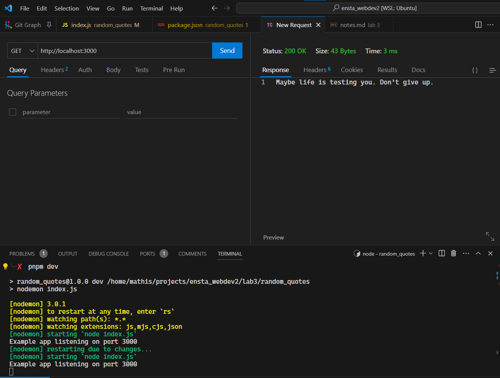
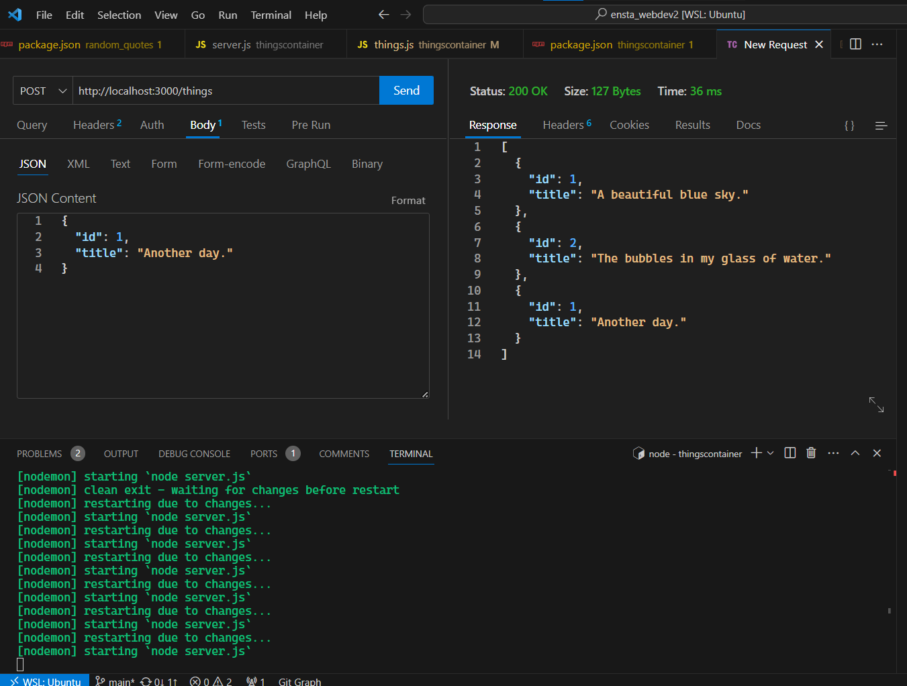
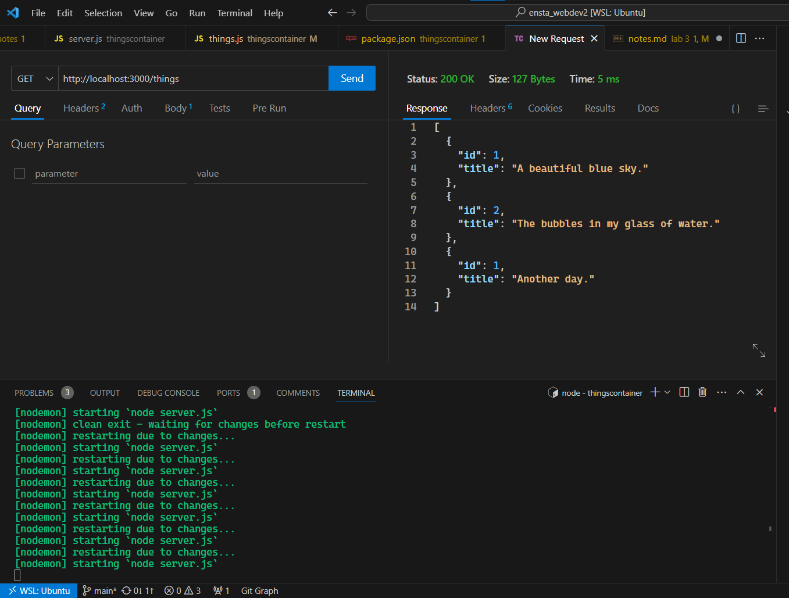

# Lab 3 - MicroFramework ExpressJS

## Exercice 1 - Hello World and random quotes

- Create the simple ExpressJS server app with "Hello World" message

- Add random quotes to the app

## Exercice 2 - Things app

- Create a simple Express app with a router.
- POST /things route that will add a new thing (string) to the list of things.

- GET /things route that will return the list of things.

