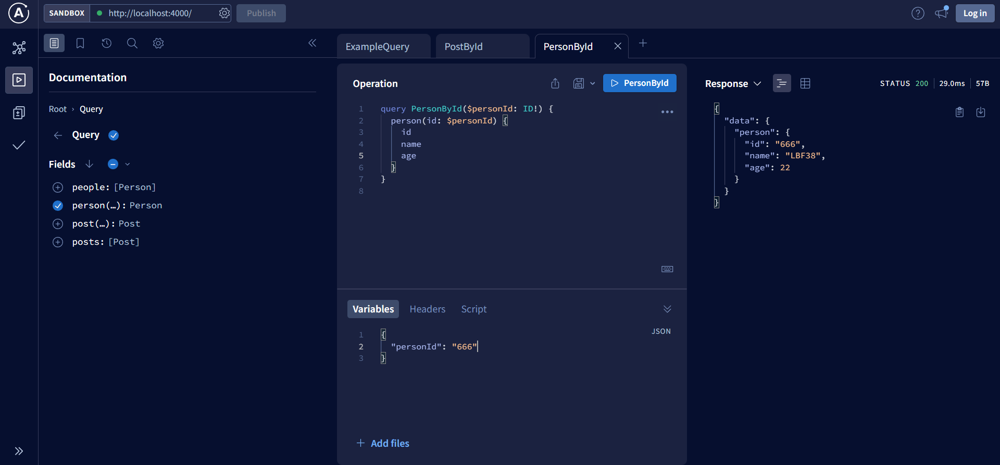
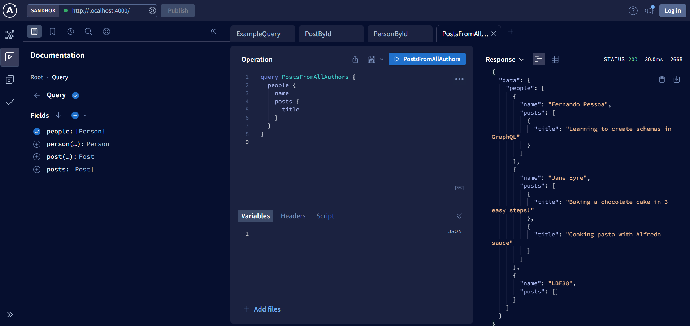
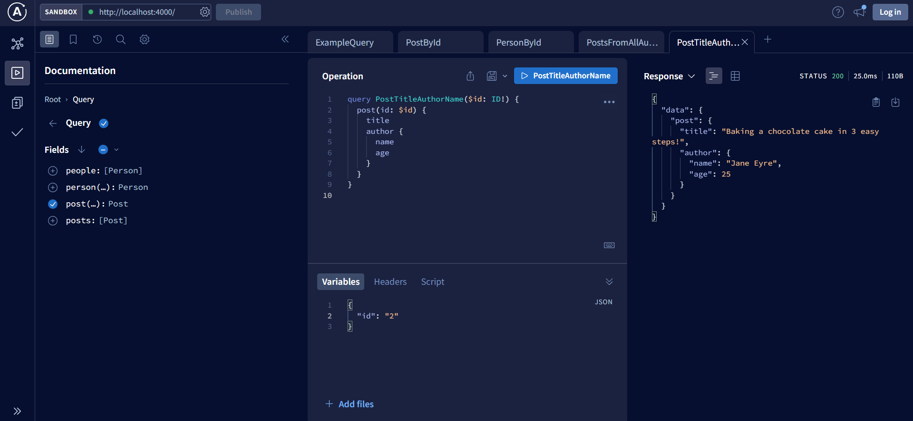
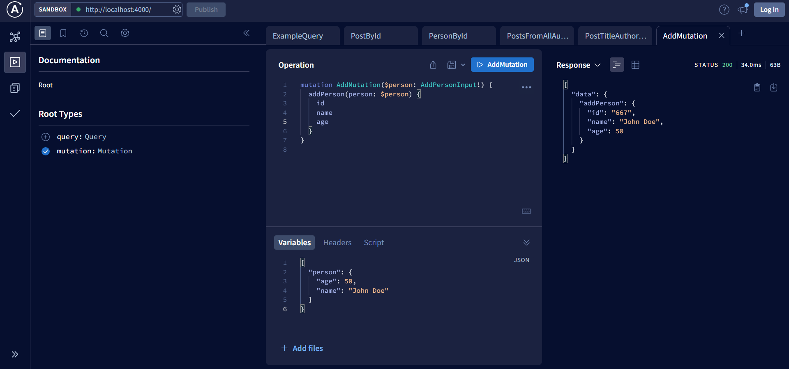
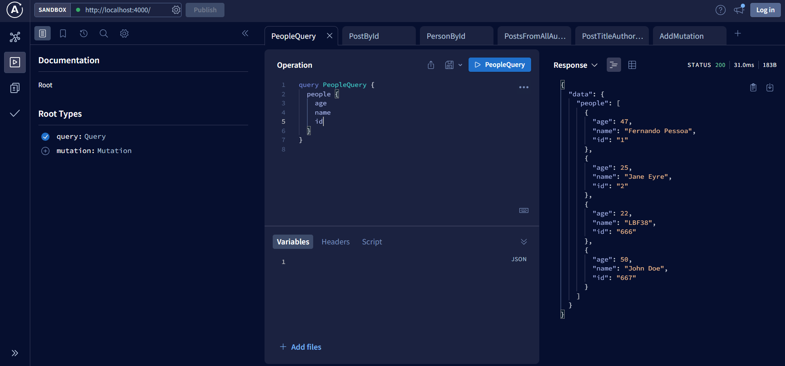

# Lab 4 - GraphQL API (apollo server)

We create a simple GraphQL API using @apollo/server library.

- First simple query on People and Posts

- Query variables
Add the possibility to get a post from id:

- Add `person` query to get a person from `id`:

- `PostsFromAllAuthors`

- `PostTitleAuthorName`

- Add a mutation to add people

=> verified by making a query on `people`

