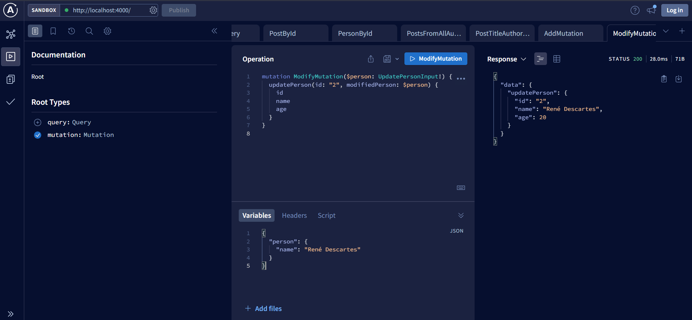
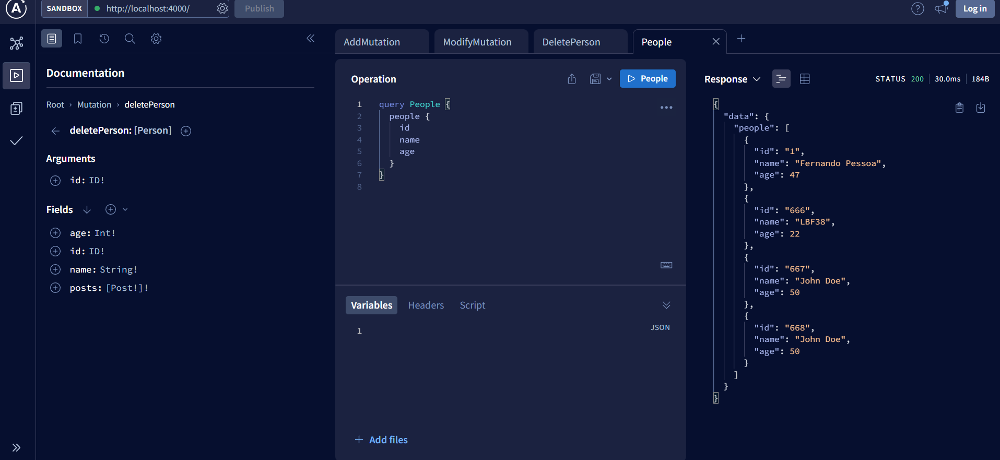
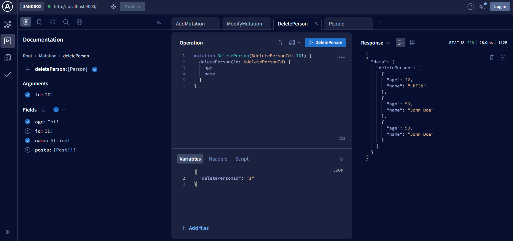
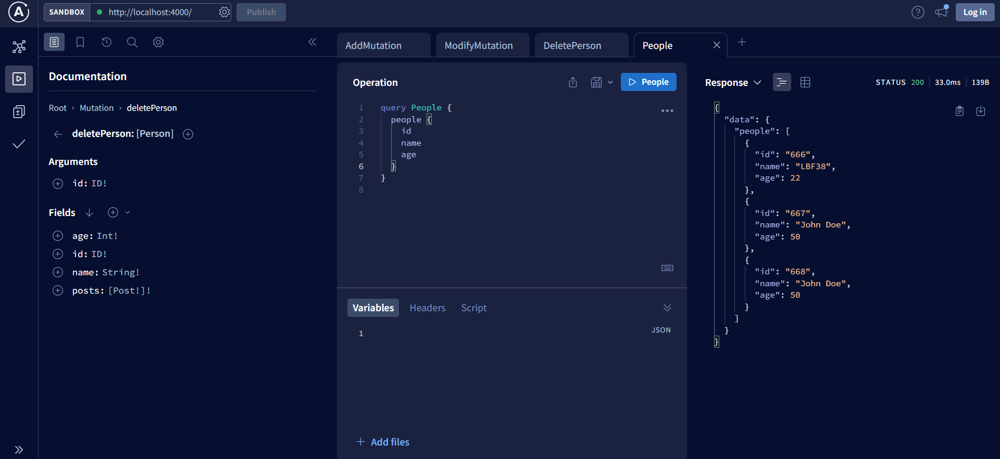

# Lab 4 - GraphQL API (apollo server)

We create a simple GraphQL API using @apollo/server library.

- First simple query on People and Posts

- Query variables
Add the possibility to get a post from id:

- Add `person` query to get a person from `id`:

- `PostsFromAllAuthors`

- `PostTitleAuthorName`

- Add a mutation to add people

=> verified by making a query on `people`

- Modify people info mutation

- Delete people mutation

=> we have the following current people

=> we then delete one of them

=> we check the result

The response of the delete mutation is the persons not deleted. And it correctly matches the check we made on the next query.
