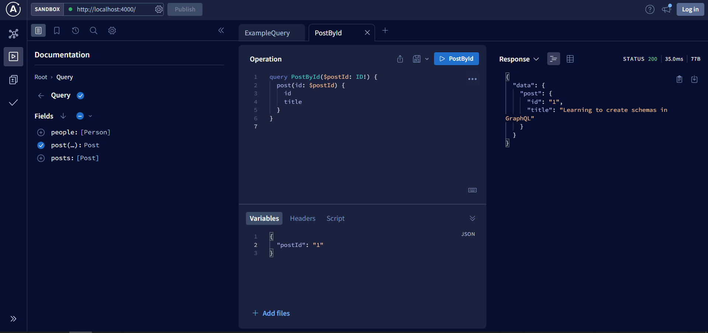

# Lab 4 - GraphQL API (apollo server)

We create a simple GraphQL API using @apollo/server library.

- First simple query on People and Posts

- Query variables
Add the possibility to get a post from id:

